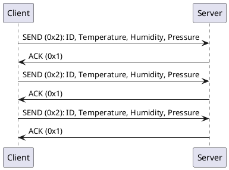

# Wireshark Dissector Example

1. Start server
```bash
go run server/server.go
```

2. Start client
```bash
go run ./client --addr=localhost:12345
```

3. Copy [weather.lua](./wireshark/dissectors/weather.lua) to `%WIRESHARK_PATH%/plugins/weather/`

#### Screenshots


#### Client <-> Server Flow


