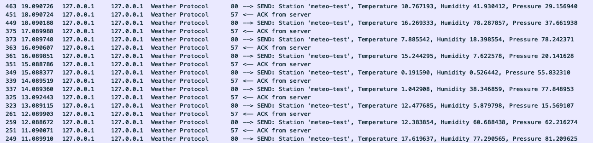
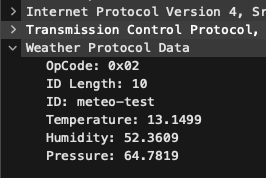
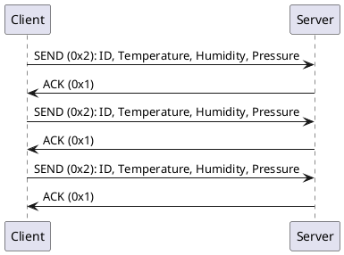

# Wireshark Dissector Example

1. Start server
```bash
go run server/server.go
```

2. Start client
```bash
go run ./client --addr=localhost:12345
```

3. Copy [weather.lua](./wireshark/dissectors/weather.lua) to `%WIRESHARK_PATH%/plugins/weather/`

#### Screenshots





#### Messages

1. Send (0x1) - Send weather info to the server

```
| OpCode | ID Length | Station ID  | Temperature | Humidity | Pressure |
| ------ | --------- | ----------- | ----------- | -------- | -------- |
| 1 byte | 1 byte    | (id length) | 4 bytes     | 4 bytes  | 4 bytes  |
```

2. Ack (0x2) - Acknowledge from server

```
| OpCode |
| ------ |
| 1 byte |
```

#### Client <-> Server Flow


